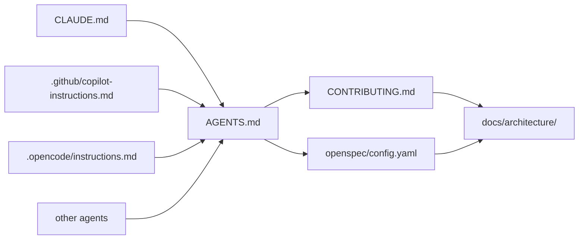

# Cascading Instructions

Collaboration between humans and agents — shared knowledge that helps everyone do their best work together.

## How It Works



**Four layers, no redundancy:**

1. **Tool-specific files** (CLAUDE.md, .github/copilot-instructions.md, .opencode/instructions.md) -- minimal pointers to AGENTS.md, plus tool-specific context (e.g., where to find commands/prompts for that tool).

2. **AGENTS.md** -- rules that only matter to AI agents (don't generate stubs, don't add dependencies without asking, match existing patterns). References CONTRIBUTING.md for shared rules.

3. **CONTRIBUTING.md** -- code quality principles shared by humans and agents: clean code, YAGNI, refactoring guidelines, documentation-as-living-artifacts. This is the single source of truth for how code should be written.

4. **openspec/config.yaml** -- spec-driven workflow configuration. Provides project context (tech stack, conventions, domain knowledge, data model guidelines) and per-artifact rules (e.g., design docs must include deployment diagrams). Agents use this when creating proposals, designs, specs, and task breakdowns via OpenSpec.

**Why this structure:**
- Humans read CONTRIBUTING.md. Agents read their tool file, then AGENTS.md, then CONTRIBUTING.md. Everyone follows the same code quality rules.
- Agent-specific guardrails (no placeholder code, no barrel files, etc.) stay out of human docs.
- Adding a new tool means one small pointer file, not duplicating all rules.

## Setting Up (works for greenfield and brownfield)

### 1. Take stock of what exists

Audit your repo for existing contributor docs, code style guides, architecture diagrams, and agent instruction files. Note what can be consolidated and what's missing. The goal is to avoid duplication — reuse and enhance before creating.

### 2. Establish CONTRIBUTING.md as the shared foundation

Create or enhance it with sections that apply to both humans and agents:
- **Clean Code Principles** -- naming conventions, function design (SRP, max params, guard clauses), code organization (no dead code, named constants)
- **YAGNI** -- no speculative abstractions, no config for single values, scope limited to current task
- **Refactoring Guidelines** -- boy scout rule (only in files you're touching), separate refactoring commits from behavior changes, tests before and after
- **Documentation as Living Artifacts** -- where architecture docs live, definition of done includes updating them

### 3. Create AGENTS.md for agent-specific guardrails

Content covers failure modes unique to AI agents:
- Read existing code/specs before generating new code
- No stubs, no TODOs, no unnecessary abstractions
- No new dependencies without asking
- Match surrounding code style, don't reformat beyond scope
- One logical change per commit

Start with: `Read [CONTRIBUTING.md](CONTRIBUTING.md) first.`

### 4. Add tool-specific pointer files

Each file follows the same ~8-line template:

```markdown
# <Tool> Instructions

Read and follow all instructions in [AGENTS.md](AGENTS.md) before starting any task.

## Project-Specific Context

- Runtime and package manager: <your runtime>
- Monorepo workspaces: <your workspaces>
- Feature workflow: <your workflow system>
```

Create at:
- `CLAUDE.md` (Claude Code)
- `.github/copilot-instructions.md` (GitHub Copilot)
- `.opencode/instructions.md` (OpenCode/Cursor)

Adjust relative paths to AGENTS.md (e.g., `../AGENTS.md` from subdirectories).

### 5. Create `docs/architecture/` with C4 model views

- `context.md` -- system context: your system and its external actors
- `container.md` -- containers: applications, databases, queues, storage
- `component.md` -- components within each container (modules, services)
- `deployment.md` -- deployment topology: infrastructure services, ports, volumes

These are long-living documents maintained by both humans and agents. Reference them from CONTRIBUTING.md's "Documentation as Living Artifacts" section.

### 6. Clean up

Update or remove any existing config, READMEs, or scattered docs that duplicate what you've centralized.
