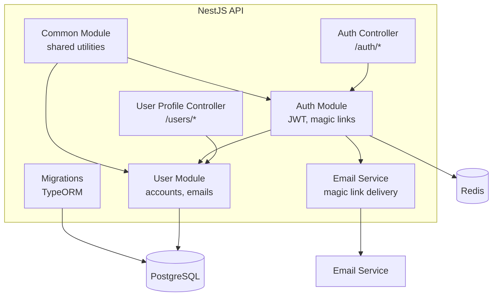

# Component View

## Backend (NestJS API)

### Modules

| Module | Responsibility |
|--------|---------------|
| Auth | Passwordless magic link authentication, JWT session management, guest account creation |
| User | User entity management (profiles, nicknames), email associations, account lifecycle |
| Email | Magic link email composition and delivery via external email service |
| Common | Shared utilities, guards, decorators |
| Migrations | TypeORM database schema migrations |

## Frontend (React PWA)

| Area | Responsibility |
|------|---------------|
| Components | Reusable UI components |
| Stores | Client-side state management |

## Worker (Image Analysis)

| Component | Responsibility |
|-----------|---------------|
| Job Processor | Dequeues BullMQ jobs from Redis, calls OpenAI Vision API, stores results |
