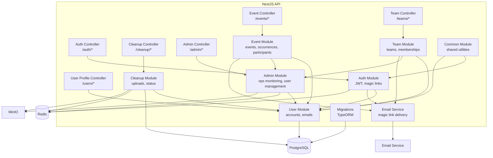

# Component View

## Backend (NestJS API)

```mermaid
graph TD
    subgraph API["NestJS API"]
        AuthCtrl["Auth Controller<br/>/auth/*"]
        UserCtrl["User Profile Controller<br/>/users/*"]
        CleanupCtrl["Cleanup Controller<br/>/cleanup/*"]
        EventCtrl["Event Controller<br/>/events/*"]
        TeamCtrl["Team Controller<br/>/teams/*"]
        AdminCtrl["Admin Controller<br/>/admin/*"]
        AuthModule["Auth Module<br/>JWT, magic links"]
        UserModule["User Module<br/>accounts, emails"]
        CleanupModule["Cleanup Module<br/>uploads, status"]
        EventModule["Event Module<br/>events, occurrences, participants"]
        TeamModule["Team Module<br/>teams, memberships"]
        AdminModule["Admin Module<br/>ops monitoring, user management"]
        EmailService["Email Service<br/>magic link delivery"]
        CommonModule["Common Module<br/>shared utilities"]
        Migrations["Migrations<br/>TypeORM"]
    end

    DB[("PostgreSQL")]
    Redis[("Redis")]
    MinIO["MinIO"]
    EmailProvider["Email Service"]

    AuthCtrl --> AuthModule
    UserCtrl --> UserModule
    CleanupCtrl --> CleanupModule
    EventCtrl --> EventModule
    TeamCtrl --> TeamModule
    AdminCtrl --> AdminModule
    AuthModule --> UserModule
    CleanupModule --> UserModule
    EventModule --> UserModule
    EventModule --> AdminModule
    EventModule --> EmailService
    TeamModule --> UserModule
    TeamModule --> AdminModule
    TeamModule --> EmailService
    AdminModule --> UserModule
    AdminModule --> Redis
    AdminModule --> MinIO
    AuthModule --> EmailService
    UserModule --> DB
    CleanupModule --> DB
    CleanupModule --> Redis
    AuthModule --> Redis
    CleanupModule --> MinIO
    EmailService --> EmailProvider
    Migrations --> DB
    CommonModule --> AuthModule
    CommonModule --> UserModule
```

### Modules

| Module | Responsibility |
|--------|---------------|
| Auth | Passwordless magic link authentication, JWT session management, guest account creation |
| User | User entity management (profiles, nicknames), email associations, account lifecycle |
| Cleanup | Async image upload endpoint, geolocated cleanup report persistence, analysis status tracking |
| Event | Community cleanup event coordination: event lifecycle, occurrence scheduling with geolocation, participant roles (admin/member), messaging |
| Team | Team-based organization: team creation, membership with role hierarchy, active team per user, internal messaging |
| Admin | Platform administration: admin user management, operations overview (queue, worker, reports), health checks (DB, Redis, S3), failed report retry |
| Email | Magic link email composition and delivery via external email service |
| Common | Shared utilities, guards, decorators |
| Migrations | TypeORM database schema migrations |

## Frontend (React PWA)

| Area | Responsibility |
|------|---------------|
| Components | Reusable UI components |
| Stores | Client-side state management |
| Offline Outbox | IndexedDB-backed queue for offline image + thumbnail captures |

## Worker (Image Analysis)

| Component | Responsibility |
|-----------|---------------|
| Job Processor | Dequeues BullMQ jobs from Redis, calls OpenAI Vision API, stores litter-item results |
