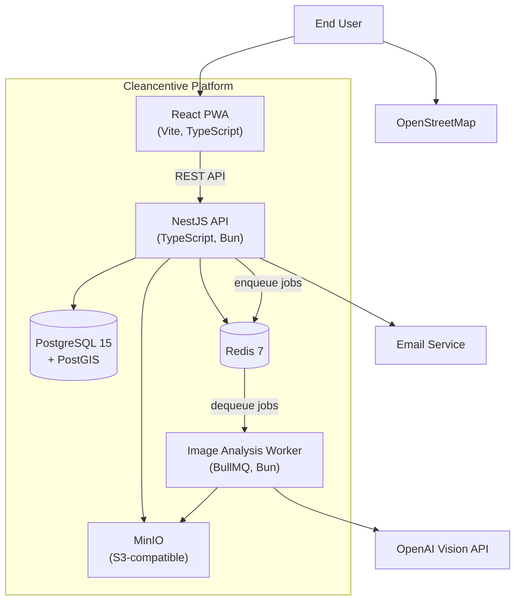

# Container View

The system is composed of application containers and infrastructure services, deployed as a monorepo with Bun workspaces.

## Containers

| Container | Technology | Purpose |
|-----------|-----------|---------|
| React PWA | React, Vite, TypeScript, MapLibre GL | Frontend progressive web app for photo capture, map viewing, and user management |
| NestJS API | NestJS, TypeScript, Bun | Backend REST API handling auth, user management, and data persistence |
| Image Analysis Worker | BullMQ, Bun | Processes image analysis jobs asynchronously via OpenAI Vision API |
| PostgreSQL + PostGIS | PostgreSQL 15, PostGIS 3.4 | Primary data store with geospatial support for location-tagged submissions |
| Redis | Redis 7 | Session storage and BullMQ job queue broker |
| MinIO | MinIO (S3 API) | Object storage for uploaded images |
