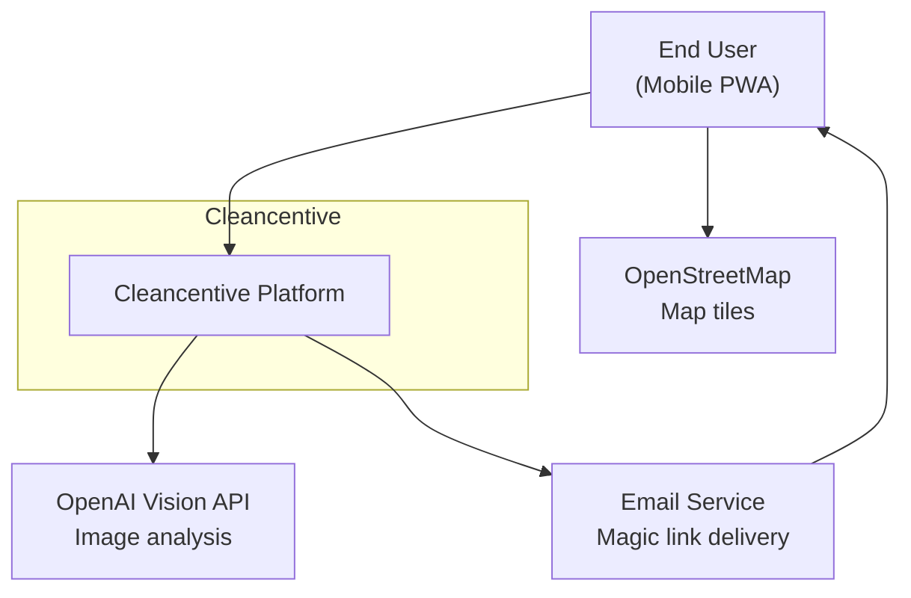

# System Context

Cleancentive is an environmental cleanup and litter tracking app. Users capture photos of litter, the system analyzes them, and contributions are mapped for visibility and gamification.

## Actors

| Actor | Description |
|-------|-------------|
| End User | Captures litter photos, views map, manages profile. Accesses the system via a PWA on mobile or desktop. |
| OpenAI Vision API | Analyzes uploaded images to classify litter type and validate submissions. |
| OpenStreetMap | Provides map tiles rendered client-side via MapLibre GL. |
| Email Service | Delivers passwordless magic link emails for authentication. |
