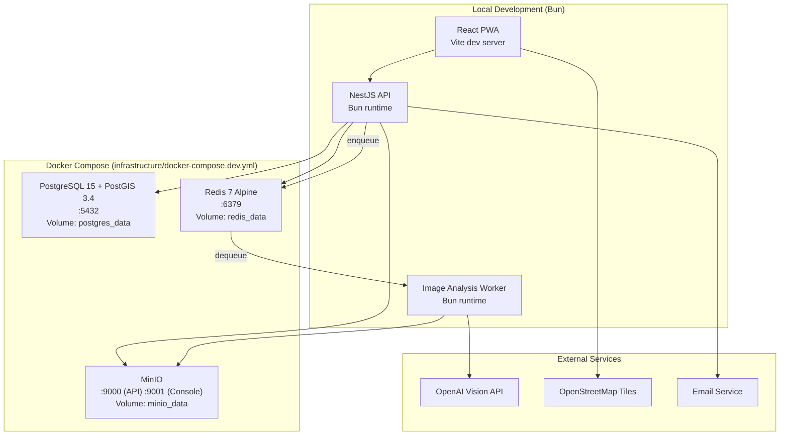

# Deployment View

## Development Environment

All infrastructure services run via Docker Compose. Application containers (API, frontend, worker) run locally with Bun.

## Docker Compose Services

| Service | Image | Ports | Health Check |
|---------|-------|-------|-------------|
| postgres | `postgis/postgis:15-3.4` | 5432 | `pg_isready` every 10s |
| redis | `redis:7-alpine` | 6379 | `redis-cli ping` every 10s |
| minio | `minio/minio:latest` | 9000 (API), 9001 (Console) | HTTP `/minio/health/live` every 15s |

All services use named Docker volumes for data persistence across restarts.
