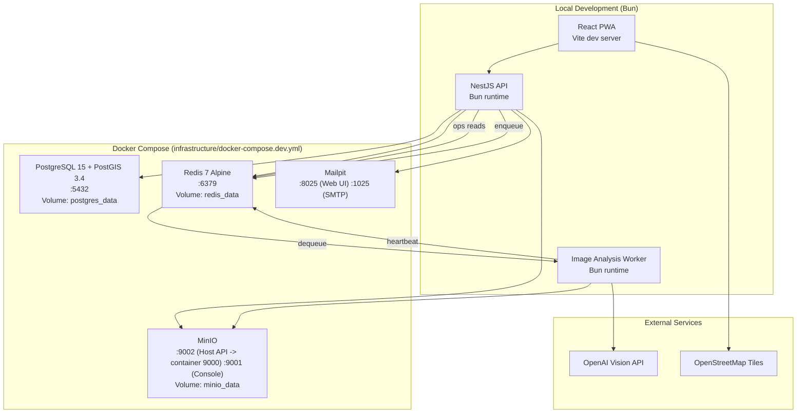

# Deployment View

## Development Environment

All infrastructure services run via Docker Compose. Application containers (API, frontend, worker) run locally with Bun.

```mermaid
graph TD
    subgraph Local["Local Development (Bun)"]
        PWA["React PWA<br/>Vite dev server"]
        API["NestJS API<br/>Bun runtime"]
        Worker["Image Analysis Worker<br/>Bun runtime"]
    end

    subgraph Docker["Docker Compose (infrastructure/docker-compose.dev.yml)"]
        DB["PostgreSQL 15 + PostGIS 3.4<br/>:5432<br/>Volume: postgres_data"]
        Redis["Redis 7 Alpine<br/>:6379<br/>Volume: redis_data"]
        MinIO["MinIO<br/>:9002 (Host API -> container 9000) :9001 (Console)<br/>Volume: minio_data"]
        Mailpit["Mailpit<br/>:8025 (Web UI) :1025 (SMTP)"]
    end

    subgraph External["External Services"]
        OpenAI["OpenAI Vision API"]
        OSM["OpenStreetMap Tiles"]
    end

    PWA --> API
    PWA --> OSM
    API --> DB
    API --> Redis
    API --> MinIO
    API --> Mailpit
    API -->|ops reads| Redis
    API -->|enqueue| Redis
    Redis -->|dequeue| Worker
    Worker -->|heartbeat| Redis
    Worker --> OpenAI
    Worker --> MinIO
```

## Docker Compose Services

| Service | Image | Ports | Health Check |
|---------|-------|-------|-------------|
| postgres | `postgis/postgis:15-3.4` | 5432 | `pg_isready` every 10s |
| redis | `redis:7-alpine` | 6379 | `redis-cli ping` every 10s |
| minio | `minio/minio:latest` | 9002 (Host API -> container 9000), 9001 (Console) | HTTP `/minio/health/live` every 15s |
| mailpit | `axllent/mailpit:latest` | 8025 (Web UI), 1025 (SMTP) | — |

All services use named Docker volumes for data persistence across restarts.
